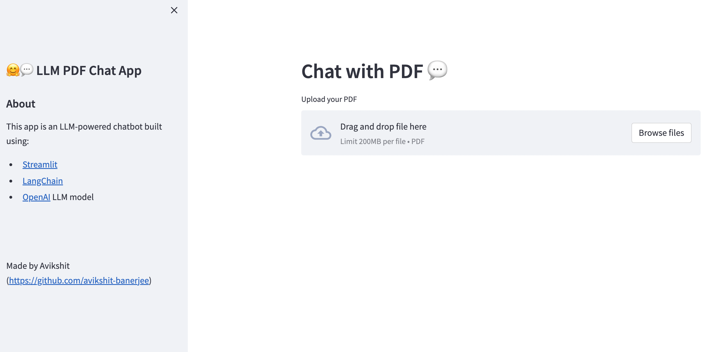

# PDF LLM-Chat App (Langchain & FAISS)


> A web application built using Langchain and Streamlit to allow users to upload their PDF files and chat with them. It leverages OpenAI API to process the PDF content and FAISS to create a vector database for efficient similarity search.

## Table of Contents

- [Introduction](#introduction)
- [Features](#features)
- [Installation](#installation)
- [Usage](#usage)
- [Technologies](#technologies)
- [Contributing](#contributing)
- [License](#license)

## Introduction



The PDF Chat App is a user-friendly web application that facilitates the upload of PDF files and enables users to engage in a chat-like interaction with their uploaded documents. By utilizing Langchain and Streamlit, this app offers a seamless experience for users to interact with their PDF content in a conversational manner.

The core functionality of the app relies on the OpenAI API, which processes the content of the PDF files to enable intelligent interactions. Additionally, the application leverages FAISS, a library for efficient similarity search, to create a vector database for the uploaded PDF files, allowing users to perform quick searches and retrieve similar documents.

## Features

- Upload and process PDF files
- Chat-like interface for interacting with PDF content
- Intelligent processing of PDF content using the OpenAI API
- Efficient similarity search using FAISS
- User-friendly and intuitive interface

## Installation

1. Clone the repository:

   ```shell
   git clone https://github.com/avikshit-banerjee/LLM-PDF-Chat-app.git
   ```

2. Change to the project directory:

   ```shell
   cd pdf-chat-app
   ```

3. Install the required dependencies:

   ```shell
   pip install -r requirements.txt
   ```

## Usage

1. Run the Streamlit app:

   ```shell
   streamlit run app.py
   ```

2. Open your web browser and navigate to `http://localhost:8501` to access the PDF Chat App.

3. Upload your desired PDF file(s) to the app.

4. Engage in a chat-like interaction with your PDF content.

## Technologies

The following technologies were used in the development of this project:

- : The primary programming language for building the application.
- : The framework used for creating the web interface.
- : LangChain is a framework for developing applications powered by language models.
- : A library for efficient similarity search, utilized for creating a vector database for the PDF files.
- : The OpenAI API is employed to process the PDF content and enable intelligent interactions.

## Contributing

Contributions are welcome! If you find any issues or have suggestions for improvements, please feel free to open an issue or submit a pull request.

## License

This project is licensed under the [MIT License](LICENSE).
